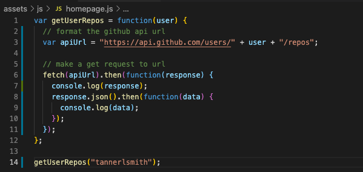
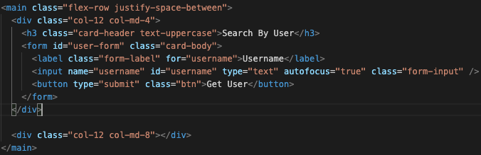
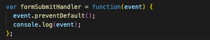
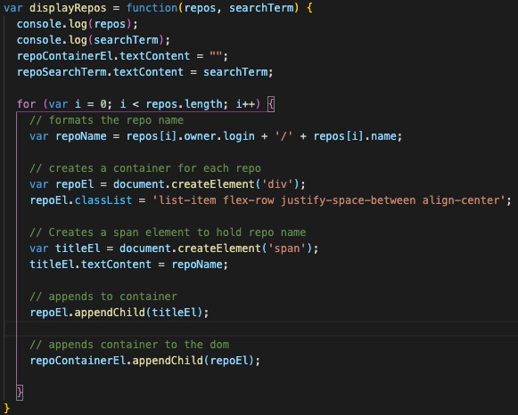

# git-it-done
[](https://opensource.org/licenses/MIT)
<p>Deployed at https://tannerlsmith.github.io/git-it-done/</p>


## Capturing Data returned from the API.
* With your fetch() request in place, we will need to read the data that were returned in the response.
* Console log the response after the fetch to check the promise. 
* Promises are callback functions. 
* JS sets fetch() requests aside and continues implemented the rest of your code, until the fetch callback is ready. This is asynchronous code. 
* Async code is referred to as AJAX. 
* With a response in place, look at the response object that is logged. 
* Fetch request looks like:
<br>


## Adding the Search Form
* The form with input capability will look like:
<br>


* Now handling the form submission by making it functional:
* We need to create variables to store references to the form: 
<br>

* ```var userFormEl = document.querySelector("#user-form");```
<br>

* ```var nameInputEl = document.querySelector("#username");```
<br>

* Next, create a handler event: 
<br>

* 
<br>

* with ```userFormEl.addEventListener('submit', formSubmitHandler);``` in place, check functionality by clicking the button and looking at the console. 

## Display Response Data on Page
* A function needs to be created in order to display Repos. 
    * This response needs to be converted to json.
        * ```response.json().then(function(data) {displayRepos(data,user)})```
<br>

* ```variableEl.textContent = searchterm``` gives you your parsed json. 
* ```variableContainerEl.appendChild(repoEl)``` appends it to the dom. 
* Below is how it gets displayed to HTML.
<br>

<br>

## Error Handling
* 200s means that the HTTP request was successful.
* 400s means that the server received HTTP req, but there's an issue missing info. 
* To handle this error, update the getUserRepos() function's fetch() request to Else { alert()}